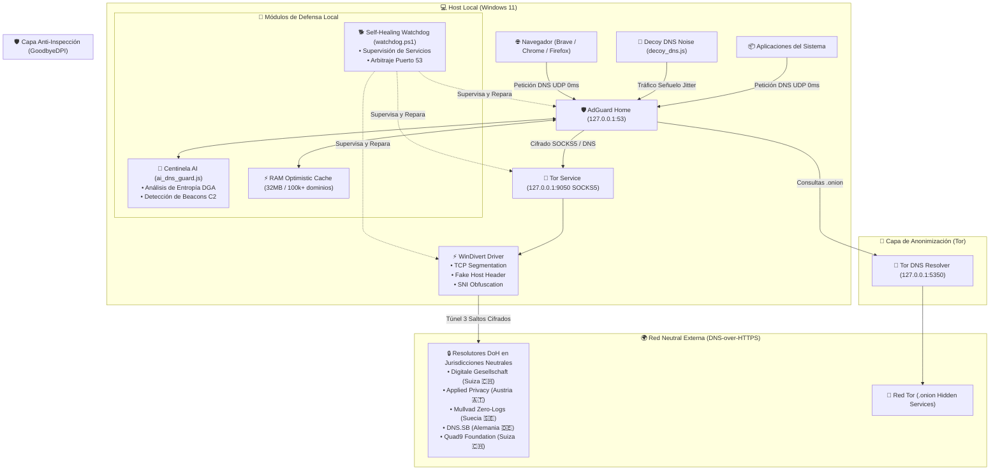

# 🛡️ AdGuard Home + Tor DNS Privacy Fortress

[](LICENSE)
[]()
[]()
[]()
[]()

> **Arquitectura de Máxima Privacidad y Evasión Anti-Censura para Windows 11 / 10:**  
> Servidor DNS local **AdGuard Home** ultra-blindado, canalizado al 100% a través de **Tor SOCKS5**, con evasión **GoodbyeDPI**, centinela **IA en tiempo real**, **generador de tráfico señuelo** y **watchdog autorreparable**.

---

## 🏛️ Diagrama de Arquitectura



---

## ✨ Características Principales

| Módulo | Función y Beneficio |
| :--- | :--- |
| **🧅 Túnel Tor SOCKS5 Integral** | Todas las peticiones DoH viajan a través de 3 saltos cifrados por la red Tor. Tu ISP jamás ve a qué servidores DNS consultas ni los dominios que visitas. |
| **🌍 Resolutores DoH Multijurisdicción** | Consultas paralelas de carrera (`parallel mode`) a Suiza (Digitale Gesellschaft, Quad9), Austria (Applied Privacy), Suecia (Mullvad) y Alemania (DNS.SB). |
| **⚡ Caché Optimista de Alta Velocidad** | 32 MB de RAM para más de 100.000 dominios. Respuestas instantáneas en 0 ms para dominios recurrentes, refrescando en segundo plano sin latencia de usuario. |
| **🛡️ Evasión de DPI (GoodbyeDPI)** | Segmentación a nivel de kernel de paquetes TCP y ofuscación de SNI para eludir firewalls gubernamentales, inspección profunda del ISP y censura. |
| **🛠️ Solución Nativa Puerto 53 Windows 11** | Incluye el script de arbitraje que neutraliza el secuestro de `0.0.0.0:53 UDP` por el servicio `SharedAccess` (ICS / Hyper-V Default Switch). |
| **🤖 Centinela AI en Tiempo Real** | Script Node.js que analiza el query log en vivo, calcula entropía de Shannon (detección de malware DGA) y vigila balizas C2 periódicas. |
| **🎲 Generador de Tráfico Señuelo (Decoy)** | Inyecta ruido estadístico y consultas aleatorias con jitter a sitios neutrales y académicos para romper el perfilado de hábitos de navegación. |
| **🐕 Watchdog Autorreparable** | Servicio supervisor en segundo plano que vigila el estado de Tor, AdGuard Home y GoodbyeDPI, reiniciándolos automáticamente ante fallos. |

---

## 🚀 Despliegue Rápido (1-Click)

### Prerrequisitos
1. **Windows 11 o 10 (64-bit)** con PowerShell 5.1 o PowerShell 7+.
2. [AdGuard Home](https://github.com/AdguardTeam/AdguardHome/releases) instalado o descomprimido en `C:\AdGuardHome`.
3. [Tor Expert Bundle](https://www.torproject.org/download/tor/) instalado como servicio (`tor.exe --service install`).
4. [GoodbyeDPI](https://github.com/ValdikSS/GoodbyeDPI) instalado como servicio (`service_install_russia_blacklist.cmd` o similar).
5. [Node.js](https://nodejs.org/) (opcional pero recomendado para el Centinela AI y el Tráfico Señuelo).

### Instalación Automatizada
Abre una consola de PowerShell como **Administrador** y ejecuta:

```powershell
# Clonar o descargar el repositorio
git clone https://github.com/jpscalero/adguardhome-tor-dns-fortress.git
cd adguardhome-tor-dns-fortress

# Ejecutar el instalador automatizado
powershell.exe -ExecutionPolicy Bypass -File scripts\install_fortress.ps1
```

El instalador:
* Neutraliza el secuestro del puerto 53 en Windows 11.
* Asigna AdGuard Home exclusivamente a `127.0.0.1:53` y `::1:53`.
* Copia la plantilla de configuración blindada `AdGuardHome.template.yaml`.
* Configura los adaptadores de red de Windows hacia `127.0.0.1`.
* Registra la tarea programada del Watchdog autorreparable.
* Ejecuta la suite de verificación de diagnóstico.

---

## 🧪 Comprobación y Diagnóstico

Para verificar en cualquier momento que la fortaleza está funcionando al 100%:

```powershell
powershell.exe -ExecutionPolicy Bypass -File scripts\test_fortress.ps1
```

Salida esperada:
```text
==========================================================
   🛡️ FORTRESS HEALTH & SECURITY DIAGNOSTIC SUITE        
==========================================================

[1] Puerto 53 UDP vinculado exclusivamente a AdGuard Home... OK
[2] Túnel Tor SOCKS5 en escucha (127.0.0.1:9050)... OK
[3] Puerto DNS nativo de Tor en escucha (UDP 127.0.0.1:5350)... OK
[4] Resolución DNS local en 127.0.0.1:53 (github.com)... (159ms) OK
[5] Resolución nativa de dominios Tor .onion (Virtual IP 10.x.x.x)... OK
[6] Bloqueo activo de telemetría y dominios de riesgo (NXDOMAIN)... OK
[7] Servicio GoodbyeDPI (Anti-DPI / WinDivert)... OK
[8] Centinela AI de detección DGA/C2 (ai_dns_guard.js)... OK
[9] Generador de tráfico señuelo anti-fingerprinting (decoy_dns.js)... OK
[10] Neutralización de secuestro de puerto 53 (SharedAccess/ICS)... OK

==========================================================
   ✅ TODAS LAS PRUEBAS SUPERADAS (10/10): FORTALEZA ACTIVA
==========================================================
```

---

## 📁 Estructura del Repositorio

```text
adguardhome-tor-dns-fortress/
├── config/
│   ├── AdGuardHome.template.yaml    # Configuración maestra blindada de AdGuard Home
│   ├── torrc.template                # Configuración endurecida del servicio Tor
│   └── .env.example                 # Variables de entorno y credenciales de ejemplo
├── scripts/
│   ├── install_fortress.ps1         # Instalador automatizado para Windows 11/10
│   ├── test_fortress.ps1            # Suite de comprobación de salud y diagnósticos
│   ├── watchdog.ps1                 # Watchdog de supervisión y autorrecuperación
│   ├── ai_dns_guard.js              # Centinela AI de detección de amenazas y DGA
│   └── decoy_dns.js                 # Generador de tráfico señuelo y ofuscación
├── launchers/
│   ├── start_watchdog.vbs           # Lanzador silencioso en segundo plano para Watchdog
│   ├── start_ai_guard.vbs           # Lanzador silencioso para Centinela AI
│   └── start_decoy.vbs              # Lanzador silencioso para Tráfico Señuelo
├── docs/
│   ├── ARCHITECTURE.md              # Documentación técnica y modelo de amenazas
│   └── WINDOWS_PORT_53_FIX.md       # Explicación a fondo del fix para SharedAccess
├── tools/                           # Scripts utilitarios para migración y hardening avanzado
│   ├── build_master_fortress.js     # Constructor de configuración unificada
│   ├── apply_full_frontier_hardening.js # Optimizador TLS local y amnesic logs
│   ├── apply_maximum_hardening.js   # Inyector de protección Bogus NXDOMAIN y TTL
│   ├── apply_server_security_privacy.js # Restricciones de red privada y rate limiting
│   └── update_adguard_settings.js   # Actualizador selectivo de reglas y bootstraps
├── .gitignore                       # Protección estricta de credenciales, logs y claves
├── LICENSE                          # Licencia MIT
└── package.json                     # Metadatos del proyecto
```

---

## 📚 Wiki Oficial y Documentación Completa

Toda la documentación técnica exhaustiva está disponible en la **[Wiki Oficial de GitHub](https://github.com/jpscalero/adguardhome-tor-dns-fortress/wiki)**:

* 📖 **[Manual Maestro Integral de la Fortaleza (wiki-adguard)](https://github.com/jpscalero/adguardhome-tor-dns-fortress/wiki/wiki-adguard)**: Filosofía, modelo de amenazas, diagramas y configuración completa.
* 🏛️ **[Arquitectura y Flujo de Datos](https://github.com/jpscalero/adguardhome-tor-dns-fortress/wiki/Arquitectura-y-Flujo-de-Datos)**: Diagrama de secuencia temporal, caché optimista en RAM y ciclo de paquetes.
* 🔒 **[Criptografía DNSSEC & Bogus NXDOMAIN](https://github.com/jpscalero/adguardhome-tor-dns-fortress/wiki/Criptografia-DNSSEC-y-Seguridad-Criptografica)**: Cadena de confianza (KSK/ZSK/RRSIG) y neutralización del secuestro por ISPs.
* 🛠️ **[Solución Definitiva al Puerto 53 en Windows 11](https://github.com/jpscalero/adguardhome-tor-dns-fortress/wiki/Solucion-Puerto-53-Windows-11)**: Ingeniería inversa de `ipnathlp.dll`, uso de `IcsDnsEnabled` y arbitraje de sockets.
* 🤖 **[Centinela AI y Tráfico Señuelo](https://github.com/jpscalero/adguardhome-tor-dns-fortress/wiki/Centinela-AI-y-Trafico-Senuelo)**: Algoritmo de Entropía de Shannon para DGA, balizas C2 y jitter aleatorio (20-55s).
* 🎯 **[Listas Negras y Feeds de Amenazas](https://github.com/jpscalero/adguardhome-tor-dns-fortress/wiki/Listas-Negras-y-Feeds-de-Ciberinteligencia)**: Directorio de listas activas, sintaxis avanzada y feeds dinámicos (URLhaus/ThreatFox).
* 🌐 **[Hardening de Navegadores y Sistemas](https://github.com/jpscalero/adguardhome-tor-dns-fortress/wiki/Hardening-Navegadores-y-Sistemas)**: Encrypted Client Hello (ECH), desactivación de LLMNR, NetBIOS y WPAD en Windows.
* 📡 **[Integración en Router y Dispositivos Móviles](https://github.com/jpscalero/adguardhome-tor-dns-fortress/wiki/Integracion-en-Router-y-Dispositivos-Moviles)**: Protección para toda la LAN (Smart TVs, móviles, consolas) y VPN móvil (WireGuard/Tailscale).
* ⚡ **[Benchmarks y Pruebas de Rendimiento](https://github.com/jpscalero/adguardhome-tor-dns-fortress/wiki/Benchmarks-y-Pruebas-de-Rendimiento)**: Latencia en 0 ms con caché optimista, impacto de memoria (< 180 MB) y scripts de prueba.
* 🚨 **[Runbook de Operaciones y Disaster Recovery](https://github.com/jpscalero/adguardhome-tor-dns-fortress/wiki/Runbook-de-Operaciones-y-Disaster-Recovery)**: Procedimientos de mantenimiento, rotación de Tor y playbooks ante incidentes.

---

## 👤 Autor
* **jpscalero** - [GitHub](https://github.com/jpscalero)

## 📄 Licencia
Este proyecto está bajo la Licencia MIT. Consulta el archivo [LICENSE](LICENSE) para más detalles.
