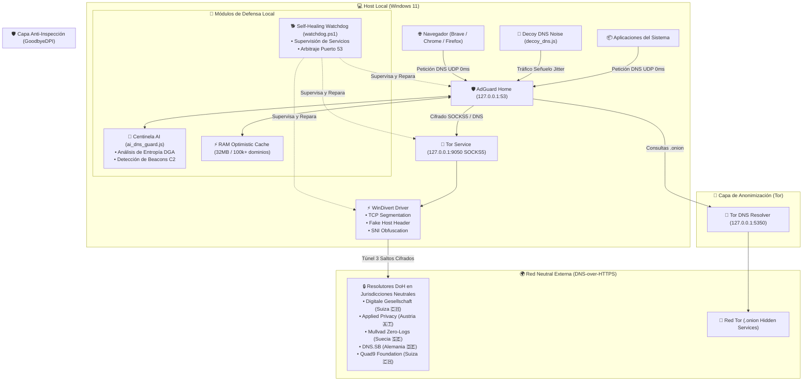

# 🏛️ Arquitectura de Seguridad y Privacidad Multicapa

## Diagrama de Flujo de Datos

---

## Principios Fundamentales del Diseño

### 1. Resistencia a Fugas (Zero-Leak Policy)
* **EDNS Client Subnet (ECS) Desactivado**: Ni tu IP pública ni la subred de tu ISP se transmiten en las cabeceras DNS a los servidores destino.
* **Bloqueo AAAA Forzado**: En entornos donde el proveedor o la VPN no tiene túnel IPv6 completo, las peticiones IPv6 se cancelan de inmediato para evitar bypass de consultas DNS no enrutadas.
* **Refuse ANY**: Se deniegan automáticamente consultas de tipo `ANY` para prevenir amplificación DNS y reconocimiento de infraestructura.

### 2. Anonimización por Multi-Salto
* Ningún resolvedor DNS upstream conoce la IP real del usuario. Todos los paquetes DoH son transmitidos a través del circuito Tor (3 saltos: Entry Guard -> Middle Relay -> Exit Relay).
* Las consultas a servidores suizos y austriacos se ejecutan en modo **Paralelo Competitivo** (`parallel`), aceptando la respuesta criptográficamente verificada más rápida (DNSSEC).

### 3. Evasión de Inspección Profunda (Anti-DPI)
* **GoodbyeDPI** opera a nivel de paquete en el kernel de Windows a través de `WinDivert`. Fragmenta el handshake inicial TLS e inyecta paquetes SNI desfasados para neutralizar cualquier firewall estatal, corporativo o de ISP que intente registrar las consultas o bloquear sitios web.

### 4. Inteligencia Artificial Centinela y Tráfico Señuelo
* **`ai_dns_guard.js`**: Inspecciona continuamente el log de consultas en memoria. Calcula la entropía de Shannon para detectar dominios DGA (típicos de malware) y analiza la desviación estándar de los intervalos temporales para neutralizar beacons periódicos de troyanos C2.
* **`decoy_dns.js`**: Emite periódicamente consultas a dominios académicos, culturales y de código abierto con jitter aleatorio para frustrar el análisis de perfiles de navegación y correlación temporal de tráfico.
